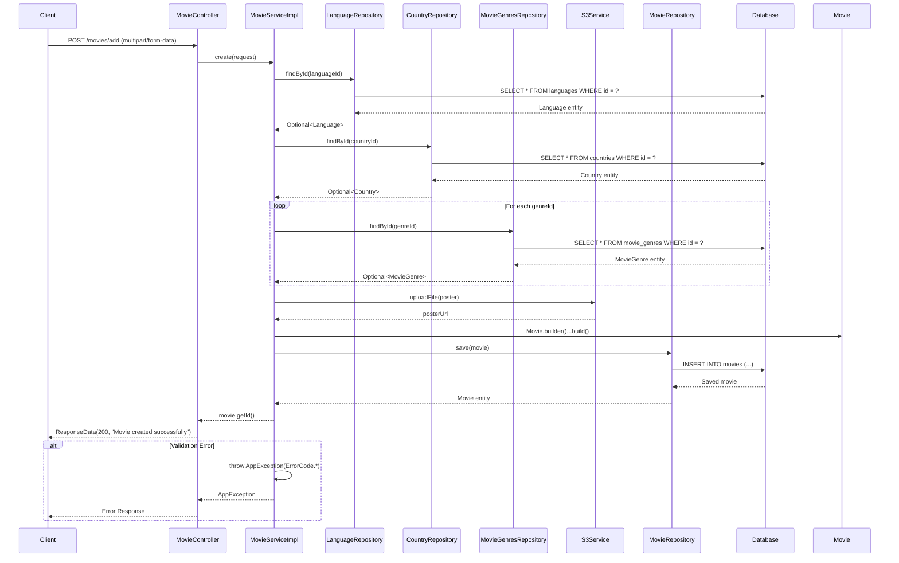

# Class Diagram - Add Movie Logic Only

## Mermaid Class Diagram

```mermaid
classDiagram
    %% Controller Layer
    class MovieController {
        -MovieService movieService
        +createMovie(request: MovieCreationRequest) ResponseData
    }

    %% Service Layer
    class MovieService {
        <<interface>>
        +create(request: MovieCreationRequest) Long
    }

    class MovieServiceImpl {
        -MovieRepository movieRepository
        -LanguageRepository languageRepository
        -CountryRepository countryRepository
        -MovieGenresRepository movieGenresRepository
        -S3Service s3Service
        +create(request: MovieCreationRequest) Long
        -findLanguageById(id: Long) Language
        -findCountryById(id: Long) Country
        -findMovieGenreById(id: Long) MovieGenre
    }

    %% Repository Layer
    class MovieRepository {
        <<interface>>
        +save(entity: Movie) Movie
    }

    class LanguageRepository {
        <<interface>>
        +findById(id: Long) Optional~Language~
    }

    class CountryRepository {
        <<interface>>
        +findById(id: Long) Optional~Country~
    }

    class MovieGenresRepository {
        <<interface>>
        +findById(id: Long) Optional~MovieGenre~
    }

    %% Model Layer
    class Movie {
        -Long id
        -String name
        -String description
        -Integer duration
        -LocalDate releaseDate
        -String director
        -String actor
        -Integer ageRating
        -String trailerUrl
        -String posterUrl
        -MovieStatus status
        -Language language
        -Country country
        -Set~MovieGenre~ movieGenres
        -Boolean isDeleted
        +getId() Long
    }

    class MovieCreationRequest {
        -String name
        -String description
        -Integer duration
        -LocalDate releaseDate
        -String director
        -String actor
        -Integer ageRating
        -String trailerUrl
        -List~Long~ genreIds
        -Long languageId
        -Long countryId
        -MultipartFile poster
    }

    class Language {
        -Long id
        -String name
    }

    class Country {
        -Long id
        -String name
    }

    class MovieGenre {
        -Long id
        -String name
    }

    class MovieStatus {
        <<enumeration>>
        UPCOMING
        PLAYING
        ENDED
    }

    %% Service Layer
    class S3Service {
        +uploadFile(file: MultipartFile) String
    }

    %% Exception Layer
    class AppException {
        -ErrorCode errorCode
        -String message
    }

    class ErrorCode {
        <<enumeration>>
        LANGUAGE_NOT_FOUND
        COUNTRY_NOT_FOUND
        MOVIE_GENRE_NOT_FOUND
        FILE_UPLOAD_FAILED
    }

    %% Response Layer
    class ResponseData {
        -int status
        -String message
        -Object data
    }

    %% Relationships
    MovieController --> MovieService : uses
    MovieService <|.. MovieServiceImpl : implements
    MovieServiceImpl --> MovieRepository : uses
    MovieServiceImpl --> LanguageRepository : uses
    MovieServiceImpl --> CountryRepository : uses
    MovieServiceImpl --> MovieGenresRepository : uses
    MovieServiceImpl --> S3Service : uses
    MovieServiceImpl --> AppException : throws
    MovieRepository --> Movie : manages
    LanguageRepository --> Language : manages
    CountryRepository --> Country : manages
    MovieGenresRepository --> MovieGenre : manages
    Movie --> Language : has
    Movie --> Country : has
    Movie --> MovieGenre : has many
    Movie --> MovieStatus : has
    AppException --> ErrorCode : uses
    MovieController --> ResponseData : returns
    MovieController --> MovieCreationRequest : receives

    %% Notes
    note for MovieController "REST Controller\n@PostMapping(\"/add\")\nHandles multipart/form-data requests"
    note for MovieServiceImpl "Service Implementation\n@Transactional\nCreates movie with file upload"
    note for Movie "Entity Model\nBuilder pattern\nStatus set to UPCOMING by default"
    note for S3Service "File Upload Service\nHandles poster image upload to AWS S3"
    note for AppException "Custom Exception\nThrown when validation fails"
```

## Sequence Diagram - Add Movie Flow



## Core Add Logic

### 1. **File Upload Pattern**

- Uses `MultipartFile` for poster image upload
- S3Service handles AWS S3 file storage
- Returns URL for uploaded file

### 2. **Validation Pattern**

- Bean validation annotations on DTO
- Custom validators for file types
- Business logic validation in service

### 3. **Builder Pattern**

- Movie entity uses builder pattern
- Clean object construction
- Immutable object creation

### 4. **Transaction Management**

- `@Transactional` annotation ensures data consistency
- Rollback on any error during the process

### 5. **Relationship Management**

- Fetches related entities (Language, Country, Genres)
- Validates all foreign key relationships
- Sets up proper associations

## API Endpoint

```
POST /api/movies/add
Content-Type: multipart/form-data
```

**Request Parameters:**

- `name` (String) - Movie name
- `description` (String) - Movie description
- `duration` (Integer) - Duration in minutes
- `releaseDate` (LocalDate) - Release date
- `director` (String) - Director name
- `actor` (String) - Actor names
- `ageRating` (Integer) - Age rating
- `trailerUrl` (String) - Trailer URL
- `genreIds` (List<Long>) - Genre IDs
- `languageId` (Long) - Language ID
- `countryId` (Long) - Country ID
- `poster` (MultipartFile) - Poster image file

**Response:**

```json
{
  "status": 200,
  "message": "Movie created successfully",
  "data": null
}
```

**Error Response:**

```json
{
  "status": 400,
  "message": "Validation failed",
  "data": null
}
```
