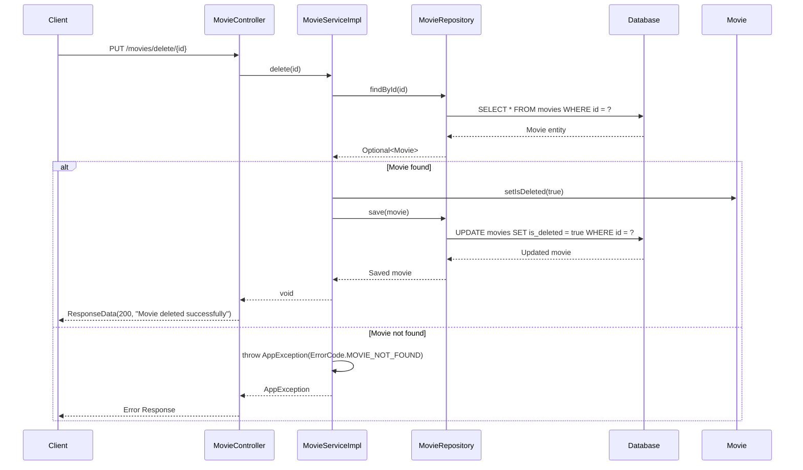

# Class Diagram - Delete Movie Logic Only

## Mermaid Class Diagram

```mermaid
classDiagram
    %% Controller Layer
    class MovieController {
        -MovieService movieService
        +deleteMovie(id: long) ResponseData
    }

    %% Service Layer
    class MovieService {
        <<interface>>
        +delete(id: long) void
    }

    class MovieServiceImpl {
        -MovieRepository movieRepository
        +delete(id: long) void
        -findById(id: Long) Movie
    }

    %% Repository Layer
    class MovieRepository {
        <<interface>>
        +findById(id: Long) Optional~Movie~
        +save(entity: Movie) Movie
    }

    %% Model Layer
    class Movie {
        -Long id
        -Boolean isDeleted
        +setIsDeleted(isDeleted: Boolean) void
        +getId() Long
    }

    %% Exception Layer
    class AppException {
        -ErrorCode errorCode
        -String message
    }

    class ErrorCode {
        <<enumeration>>
        MOVIE_NOT_FOUND
    }

    %% Response Layer
    class ResponseData {
        -int status
        -String message
        -Object data
    }

    %% Relationships
    MovieController --> MovieService : uses
    MovieService <|.. MovieServiceImpl : implements
    MovieServiceImpl --> MovieRepository : uses
    MovieServiceImpl --> AppException : throws
    MovieRepository --> Movie : manages
    AppException --> ErrorCode : uses
    MovieController --> ResponseData : returns

    %% Notes
    note for MovieController "REST Controller\n@PutMapping(\"/delete/{id}\")\nHandles HTTP requests"
    note for MovieServiceImpl "Service Implementation\n@Transactional\nSoft delete by setting isDeleted = true"
    note for Movie "Entity Model\nSoft delete pattern\nisDeleted flag for logical deletion"
    note for AppException "Custom Exception\nThrown when movie not found"
```

## Sequence Diagram - Delete Movie Flow



## Core Delete Logic

### 1. **Soft Delete Pattern**

- Sets `isDeleted = true` instead of physical deletion
- Preserves data integrity and audit trail
- Allows for potential recovery

### 2. **Transaction Management**

- `@Transactional` annotation ensures data consistency
- Rollback on any error during the process

### 3. **Error Handling**

- Throws `AppException` with `MOVIE_NOT_FOUND` error code
- Clean error propagation through layers

## API Endpoint

```
PUT /api/movies/delete/{id}
```

**Request:**

- Path Parameter: `id` (Long) - Movie ID to delete

**Response:**

```json
{
  "status": 200,
  "message": "Movie deleted successfully",
  "data": null
}
```

**Error Response:**

```json
{
  "status": 404,
  "message": "Movie not found",
  "data": null
}
```
