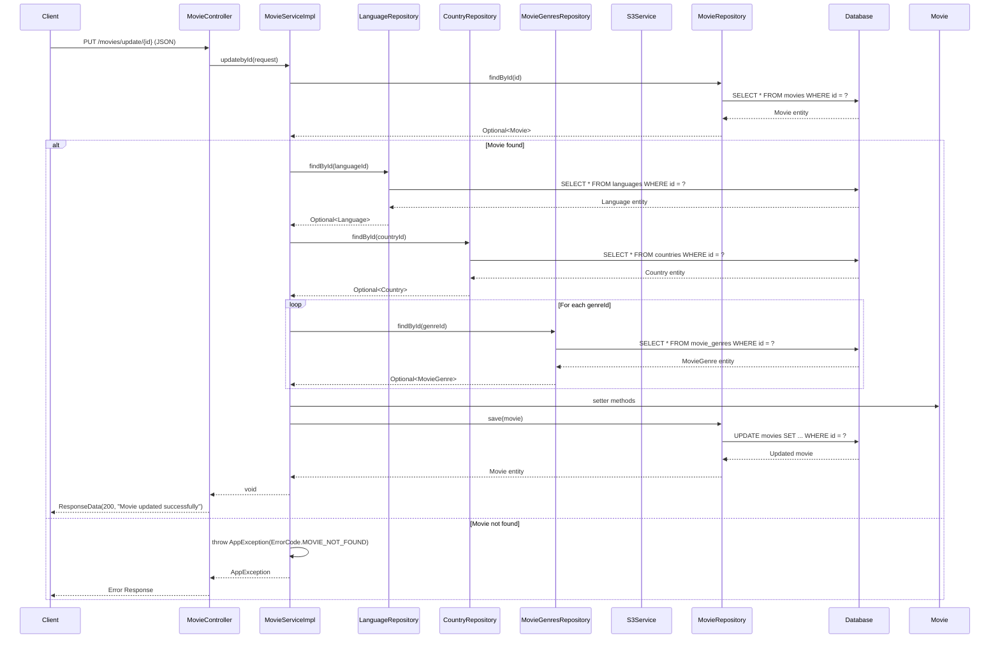
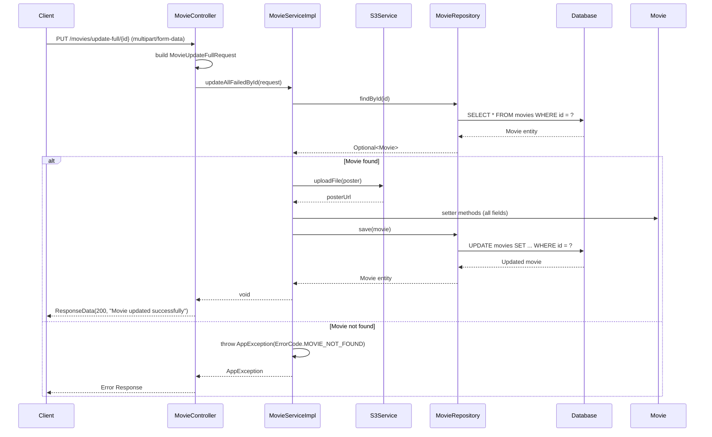

# Class Diagram - Edit Movie Logic Only

## Mermaid Class Diagram

```mermaid
classDiagram
    %% Controller Layer
    class MovieController {
        -MovieService movieService
        +updateSomeFailedById(request: MovieUpdateBasicRequest) ResponseData
        +updateFullMovieById(id: long, params...) ResponseData
    }

    %% Service Layer
    class MovieService {
        <<interface>>
        +updatebyId(request: MovieUpdateBasicRequest) void
        +updateAllFailedById(request: MovieUpdateFullRequest) void
    }

    class MovieServiceImpl {
        -MovieRepository movieRepository
        -LanguageRepository languageRepository
        -CountryRepository countryRepository
        -MovieGenresRepository movieGenresRepository
        -S3Service s3Service
        +updatebyId(request: MovieUpdateBasicRequest) void
        +updateAllFailedById(request: MovieUpdateFullRequest) void
        -findById(id: Long) Movie
        -findLanguageById(id: Long) Language
        -findCountryById(id: Long) Country
        -findMovieGenreById(id: Long) MovieGenre
    }

    %% Repository Layer
    class MovieRepository {
        <<interface>>
        +findById(id: Long) Optional~Movie~
        +save(entity: Movie) Movie
    }

    class LanguageRepository {
        <<interface>>
        +findById(id: Long) Optional~Language~
    }

    class CountryRepository {
        <<interface>>
        +findById(id: Long) Optional~Country~
    }

    class MovieGenresRepository {
        <<interface>>
        +findById(id: Long) Optional~MovieGenre~
    }

    %% Model Layer
    class Movie {
        -Long id
        -String name
        -String description
        -Integer duration
        -LocalDate releaseDate
        -String director
        -String actor
        -Integer ageRating
        -String trailerUrl
        -String posterUrl
        -MovieStatus status
        -Language language
        -Country country
        -Set~MovieGenre~ movieGenres
        -Boolean isDeleted
        +setName(name: String) void
        +setDescription(description: String) void
        +setDuration(duration: Integer) void
        +setReleaseDate(releaseDate: LocalDate) void
        +setDirector(director: String) void
        +setActor(actor: String) void
        +setAgeRating(ageRating: Integer) void
        +setTrailerUrl(trailerUrl: String) void
        +setPosterUrl(posterUrl: String) void
        +setStatus(status: MovieStatus) void
        +setLanguage(language: Language) void
        +setCountry(country: Country) void
        +setMovieGenres(movieGenres: Set~MovieGenre~) void
        +getId() Long
    }

    class MovieUpdateBasicRequest {
        -long id
        -String name
        -LocalDate releaseDate
        -List~Long~ genreIds
        -Long languageId
        -Long countryId
        -String status
    }

    class MovieUpdateFullRequest {
        -long id
        -String name
        -String description
        -Integer duration
        -LocalDate releaseDate
        -String director
        -String actor
        -Integer ageRating
        -String trailerUrl
        -List~Long~ genreIds
        -Long languageId
        -Long countryId
        -String status
        -MultipartFile poster
    }

    class Language {
        -Long id
        -String name
    }

    class Country {
        -Long id
        -String name
    }

    class MovieGenre {
        -Long id
        -String name
    }

    class MovieStatus {
        <<enumeration>>
        UPCOMING
        PLAYING
        ENDED
    }

    %% Service Layer
    class S3Service {
        +uploadFile(file: MultipartFile) String
    }

    %% Exception Layer
    class AppException {
        -ErrorCode errorCode
        -String message
    }

    class ErrorCode {
        <<enumeration>>
        MOVIE_NOT_FOUND
        LANGUAGE_NOT_FOUND
        COUNTRY_NOT_FOUND
        MOVIE_GENRE_NOT_FOUND
        FILE_UPLOAD_FAILED
    }

    %% Response Layer
    class ResponseData {
        -int status
        -String message
        -Object data
    }

    %% Relationships
    MovieController --> MovieService : uses
    MovieService <|.. MovieServiceImpl : implements
    MovieServiceImpl --> MovieRepository : uses
    MovieServiceImpl --> LanguageRepository : uses
    MovieServiceImpl --> CountryRepository : uses
    MovieServiceImpl --> MovieGenresRepository : uses
    MovieServiceImpl --> S3Service : uses
    MovieServiceImpl --> AppException : throws
    MovieRepository --> Movie : manages
    LanguageRepository --> Language : manages
    CountryRepository --> Country : manages
    MovieGenresRepository --> MovieGenre : manages
    Movie --> Language : has
    Movie --> Country : has
    Movie --> MovieGenre : has many
    Movie --> MovieStatus : has
    AppException --> ErrorCode : uses
    MovieController --> ResponseData : returns
    MovieController --> MovieUpdateBasicRequest : receives
    MovieController --> MovieUpdateFullRequest : receives

    %% Notes
    note for MovieController "REST Controller\n@PutMapping(\"/update/{id}\")\n@PutMapping(\"/update-full/{id}\")\nTwo update endpoints"
    note for MovieServiceImpl "Service Implementation\n@Transactional\nUpdates existing movie entity"
    note for Movie "Entity Model\nSetters for field updates\nStatus can be changed"
    note for S3Service "File Upload Service\nHandles poster image upload to AWS S3\nOptional for basic update"
    note for AppException "Custom Exception\nThrown when validation fails"
```

## Sequence Diagram - Edit Movie Flow



## Sequence Diagram - Edit Full Movie Flow (with file upload)



## Core Edit Logic

### 1. **Two Update Patterns**

- **Basic Update**: JSON request, limited fields
- **Full Update**: Multipart request, all fields including file upload

### 2. **Entity Update Pattern**

- Find existing movie by ID
- Update fields using setter methods
- Save updated entity

### 3. **File Upload Pattern** (Full Update only)

- Uses `MultipartFile` for poster image upload
- S3Service handles AWS S3 file storage
- Updates posterUrl field

### 4. **Validation Pattern**

- Bean validation annotations on DTOs
- Business logic validation in service
- Foreign key relationship validation

### 5. **Transaction Management**

- `@Transactional` annotation ensures data consistency
- Rollback on any error during the process

## API Endpoints

### Basic Update

```
PUT /api/movies/update/{id}
Content-Type: application/json
```

**Request Body:**

```json
{
  "id": 1,
  "name": "Updated Movie Name",
  "releaseDate": "2024-12-25",
  "genreIds": [1, 2, 3],
  "languageId": 1,
  "countryId": 1,
  "status": "PLAYING"
}
```

### Full Update

```
PUT /api/movies/update-full/{id}
Content-Type: multipart/form-data
```

**Request Parameters:**

- `name` (String) - Movie name
- `description` (String) - Movie description
- `duration` (Integer) - Duration in minutes
- `releaseDate` (LocalDate) - Release date
- `director` (String) - Director name
- `actor` (String) - Actor names
- `ageRating` (Integer) - Age rating
- `trailerUrl` (String) - Trailer URL
- `genreIds` (List<Long>) - Genre IDs
- `languageId` (Long) - Language ID
- `countryId` (Long) - Country ID
- `status` (String) - Movie status
- `poster` (MultipartFile) - Poster image file

**Response:**

```json
{
  "status": 200,
  "message": "Movie updated successfully",
  "data": null
}
```

**Error Response:**

```json
{
  "status": 404,
  "message": "Movie not found",
  "data": null
}
```
